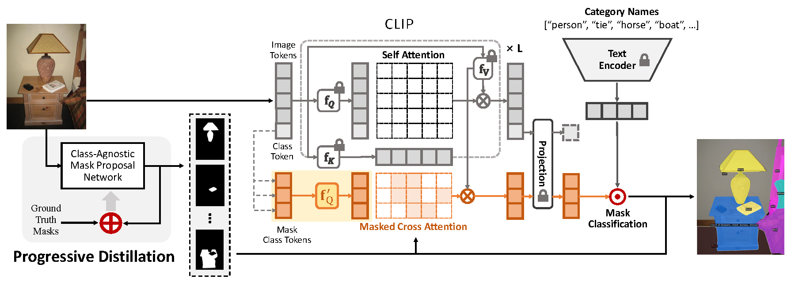

# MasQCLIP for Open-Vocabulary Universal Image Segmentation

[Xin Xu*](mailto:xinx8@illinois.edu), [Tianyi Xiong*](https://tyxiong23.github.io/), [Zheng Ding](mailto:zhding@ucsd.edu) and [Zhuowen Tu](http://www.cogsci.ucsd.edu/~ztu/) &nbsp; (\*Equal Contribution)

This is the repository for [*MasQCLIP for Open-Vocabulary Universal Image Segmentation*](https://openaccess.thecvf.com/content/ICCV2023/html/Xu_MasQCLIP_for_Open-Vocabulary_Universal_Image_Segmentation_ICCV_2023_paper.html), published at **ICCV 2023**.

[[`Project Page`](https://masqclip.github.io/)] [[`Paper`](https://openaccess.thecvf.com/content/ICCV2023/papers/Xu_MasQCLIP_for_Open-Vocabulary_Universal_Image_Segmentation_ICCV_2023_paper.pdf)]



## Dataset

Please refer to [dataset preparation](https://github.com/facebookresearch/Mask2Former/blob/main/datasets/README.md).

## Training and Testing

Please refer to [installation instructions](https://github.com/facebookresearch/Mask2Former/blob/main/INSTALL.md) for environment setup.

#### Base-novel Setting

In the base-novel setting, the model is trained on the base classes and tested on novel classes. To train a model under base-novel setting (on COCO-instance), run

```shell
# Progressive Distillation
python train_net.py --num-gpus 8 --config-file configs/base-novel/coco-instance/teacher_R50_100k_base48.yaml OUTPUT_DIR "${work_dir}/teacher"

python train_net.py --num-gpus 4 --config-file configs/base-novel/coco-instance/student_R50_30k_base48.yaml OUTPUT_DIR "${work_dir}/student" MODEL.WEIGHTS "${work_dir}/teacher/model_final.pth"

# MasQ-Tuning
python train_net.py --num-gpus 4 --config-file configs/base-novel/coco-instance/masqclip_R50_bs4_10k_base48.yaml OUTPUT_DIR "${work_dir}/masq" MODEL.WEIGHTS "${work_dir}/student/model_final.pth"
```

To evaluate a model's performance, use

```shell
python train_net.py --eval-only --num-gpus 4 --config-file configs/base-novel/coco-instance/masqclip_R50_bs4_10k_instance65.yaml OUTPUT_DIR "${work_dir}/generalized" MODEL.WEIGHTS "${work_dir}/masq/model_final.pth"
```

#### Cross-dataset Setting

In the cross-dataset setting, the model is trained on one dataset e.g., COCO, and tested on another dataset e.g., ADE20K. To train a model under cross-dataset setting (on COCO-panoptic), run

```shell
# Progressive Distillation
python train_net.py --num-gpus 8 --config-file configs/cross-dataset/coco-train/panoptic-segmentation/teacher_R50_200k.yaml OUTPUT_DIR "${work_dir}/train_coco/teacher"

python train_net.py --num-gpus 4 --config-file configs/cross-dataset/coco-train/panoptic-segmentation/student_R50_30k.yaml OUTPUT_DIR "${work_dir}/train_coco/student" MODEL.WEIGHTS "${work_dir}/train_coco/teacher/model_final.pth"

# MasQ-Tuning
python train_net.py --num-gpus 4 --config-file configs/cross-dataset/coco-train/panoptic-segmentation/masqclip_R50_bs4_10k.yaml OUTPUT_DIR "${work_dir}/train_coco/masq" MODEL.WEIGHTS "${work_dir}/train_coco/student/model_final.pth"
```

To evaluate a model's performance, use

```shell
model_path="${work_dir}/train_coco/masq/model_final.pth"

# For example, to evaluate on ADE20K-150, use
python train_net.py --eval-only --num-gpus 4 --config-file configs/cross-dataset/test/ade20k-150/panoptic-segmentation/masqclip_R50_bs4_10k.yaml OUTPUT_DIR "${work_dir}/test_ade20k_150" MODEL.WEIGHTS $model_path
```

#### Pre-trained Models

Pre-trained models can be found in this Google Drive [link](https://drive.google.com/drive/folders/1wGpl9k7lEYigvSiI2IMx_V_TBGrzfVNl?usp=sharing).

## Acknowledgment

The code is based on [MaskCLIP](https://maskclip.github.io), [Mask2Former](https://github.com/facebookresearch/Mask2Former) and [CLIP](https://github.com/openai/CLIP).


## Citation

Please consider citing MasQCLIP and MaskCLIP if you find the codes useful:

```BibTeX
@inproceedings{xu2023masqclip,
    author    = {Xu, Xin and Xiong, Tianyi and Ding, Zheng and Tu, Zhuowen},
    title     = {MasQCLIP for Open-Vocabulary Universal Image Segmentation},
    booktitle = {Proceedings of the IEEE/CVF International Conference on Computer Vision (ICCV)},
    month     = {October},
    year      = {2023},
    pages     = {887-898},
}
```

```BibTeX
@inproceedings{ding2023maskclip,
    author    = {Ding, Zheng and Wang, Jieke and Tu, Zhuowen},
    title     = {Open-Vocabulary Universal Image Segmentation with MaskCLIP},
    booktitle = {International Conference on Machine Learning},
    year      = {2023},
}
```


